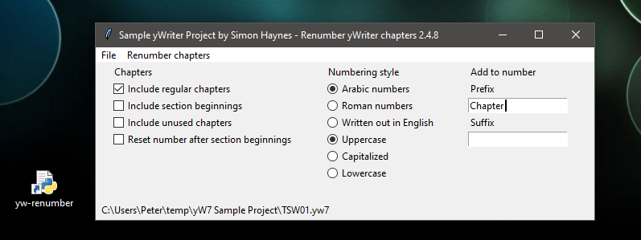

[yWriter](http://spacejock.com/yWriter7.html) is a free word processor written by Australian author and programmer Simon Haynes. 

When you create a new chapter in yWriter, a Name "Chapter x" is preset with x as chapter number. After moving the chapter, you can invoke a renumbering function. 

Non-English speakers and writers with special requirements for chapter numbering might like the *yw-renumber* software, which offers a little more variability here. Chapters can be numbered with Arabic, Roman or written out in English. In addition, the numbers can be preceded by a prefix and followed by a suffix.

*yw-renumber* works with .yw7 project files. 

The *yw-renumber* script has a graphical user interface. However, a Python 3 installation is required to run it.

## Requirements

- [Python 3](https://www.python.org). Python 3.4 or more recent will work.

## Download and install

[Download the latest release (version 1.3.1)](https://raw.githubusercontent.com/peter88213/yw-renumber/main/dist/yw-renumber_v1.3.1.zip)

- Unzip the downloaded zipfile "yw-renumber_v1.3.1.zip" into a new folder.
- Move into this new folder and launch **setup.pyw**. This installs the script for the local user.
- Create a shortcut on the desktop when asked.
- Open "README.md" for usage instructions.

### Note for Linux users

Please make sure that your Python3 installation has the *tkinter* module. On Ubuntu, for example, it is not available out of the box and must be installed via a separate package. 

------------------------------------------------------------------

[Changelog](changelog)

## Usage, Options reference

See the [instructions for use](usage)

## Credits

- User *Hunter_71* presented the number to English conversion algorithm on [stack overflow](https://stackoverflow.com/a/51849443).
- User *Aristide* presented the integer to roman numeral conversion on [stack overflow](https://stackoverflow.com/a/47713392).
- Frederik Lundh published the [xml pretty print algorithm](http://effbot.org/zone/element-lib.htm#prettyprint).

## License

yw-renumber is distributed under the [MIT
License](http://www.opensource.org/licenses/mit-license.php).
